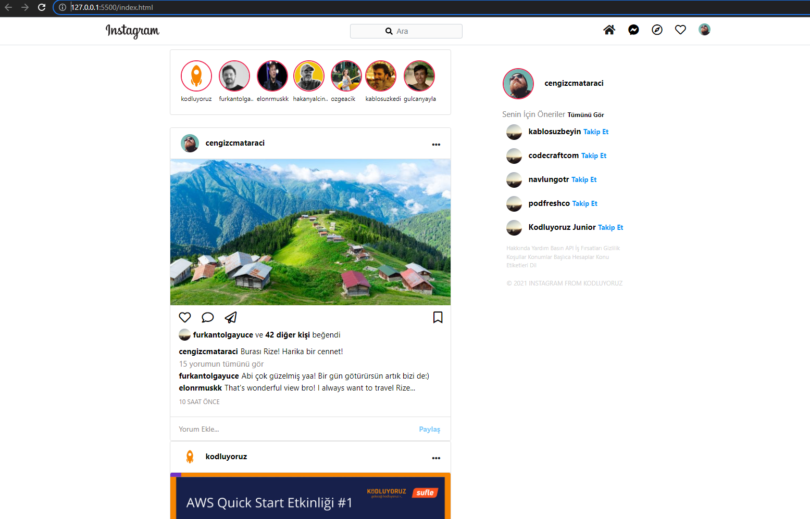

# Bootstrap Instagram Clone Odevi

## Bu ödev [Patika.dev'in](www.patika.dev) Front-End Web patikası Bootstrap dersleri kapsamında yaptığım ikinci ödev

#### Bu ödevde bootstrap kullanarak verilen template'i istenilen forma dönüştürdüm

Bu Ödevi yaparken;

- Bootstrap kullanımı konusunda oldukça fazla pratik yaptım
- Bootstrap Display yapıları hakkında yeni şeyler öğrendim
- Sticky - Fixed - Position kavramlarını kullandım
- Navbar yapısı hakkında bol pratik yaptım
- Stackoverflow - Bootstrap Docs - GitHub kullanrak çok fazla kod okuması ve araştırma yaptım

#### Proje SS

***********

[License]()